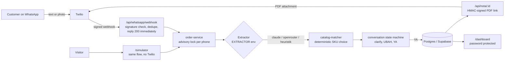

# WhatsApp Order Assistant for Building-Supply Stores

> **Ringkasan (ID):** Asisten pesanan WhatsApp untuk toko bahan bangunan. Pelanggan mengetik (atau memfoto) daftar
> belanja seperti biasa, misalnya _"smen tigaroda 15 sak, besi 10 50 btg, kirim ke proyek pak budi"_. Sistem
> mencocokkan barang ke katalog, menanyakan item yang ambigu, menghitung total, meminta konfirmasi "YA", lalu
> mengirim nota PDF. Pemilik toko memproses pesanan dari dashboard. Dibangun dengan Next.js, Postgres, dan LLM
> (Claude atau model OpenRouter), dengan 166 unit test, 4 test E2E, dan eval 30 chat berlabel.

**Problem:** Indonesian building-supply stores take orders over WhatsApp in messy shorthand, typos and regional
languages, so staff spend hours retyping them and still get items, quantities and prices wrong.
**Solution:** an assistant that turns those chats into priced, confirmed orders with a PDF invoice and a simple
order board for the owner.

**Live demo:** `YOUR-DEMO-URL/simulator` — no login, no AI cost (see [Public demo mode](#public-demo-mode)).


<sub>Recorded on the public demo mode (rule-based parser). The production path uses an LLM; its accuracy is in the
eval table below.</sub>

## Architecture



The LLM only normalizes free text into `{name, qty, unit}`. Choosing the SKU, the price and whether to ask the
customer a question is done by plain, tested code.

## Results

### Accuracy eval — 30 labeled WhatsApp chats

The eval set ([data/sample_orders.json](data/sample_orders.json)) has 6 easy, 11 medium and 13 hard chats: typos,
Javanese/Sundanese/Betawi, numbers written as words, "1 rit" / "setengah kubik" units, mid-chat corrections, 8
ambiguous items and 2 products that are not in the catalog. An order passes only if **every SKU and quantity is
right and every ambiguous item is flagged**.

| Extractor | Model | Overall | Easy | Medium | Hard | Item recall / precision | Ambiguous flagged (8 expected) | Avg latency | Cost per order |
|---|---|---|---|---|---|---|---|---|---|
| OpenRouter (free) | `nex-agi/nex-n2.5-mini:free` | **28/30 (93.3%)** | 6/6 | 10/11 | 12/13 | 98.6% / 97.1% | 7 | 3.3 s | $0 |
| Rule-based, no AI | `heuristik` | 1/30 (3.3%) | 0/6 | 1/11 | 0/13 | 30.4% / 87.5% | 20 (over-flags) | <0.1 s | $0 |
| Matcher upper bound | hand-labeled extraction | 30/30 (100%) | 6/6 | 11/11 | 13/13 | 100% / 100% | 8 | – | – |
| Claude | `claude-opus-5` | not run yet¹ | | | | | | | |
| Claude | `claude-sonnet-5` | not run yet¹ | | | | | | | |

<sub>Run on 24 Sep 2026. Raw reports: [eval/](eval/).
¹ No Anthropic API key has been used yet. The Claude path is implemented and unit-tested with a mocked client;
run `npm run eval -- --provider=claude` and `npm run eval -- --provider=claude --model=claude-sonnet-5` to fill
these rows.</sub>

**What the numbers say**

- The rule-based baseline gets 1 of 30 chats right, so an LLM is necessary for real chats.
- With a perfect extraction the matcher scores 30/30, so the remaining errors come from the LLM step, not the
  matcher. Both misses from the free model are normalization errors: it turned "pasir" into "pasir cor"
  (#20, so no clarifying question) and "pralon 3 dim" into a 3/4" pipe (#26).
- **Production recommendation:** the free model is the right default *for now* (it is what `.env` uses) and the
  rule-based parser is the right choice for the public demo. For paying customers, move to Claude, because
  free-tier models allow ~50 requests/day, were rate-limited during testing, and behave inconsistently between runs
  (see limitations). Choose between Opus 5 and the cheaper Sonnet 5 after running the two commands above; the code
  default stays `claude-opus-5` until that data exists.

### Tests

| Check | Result |
|---|---|
| Unit tests (Vitest) | **166 passed** — matcher (aliases, typos, size numbers, units, ambiguity, all 30 samples), parser with a mocked Claude client, OpenRouter client with mocked `fetch`, conversation state machine, Twilio signature, access rules, invoice/Rupiah formatting, public-demo examples |
| E2E (Playwright) | **4 passed** — owner sees today's orders and details; status baru → diproses → dikirim → selesai; anonymous visitor can use the simulator but not the dashboard; simulator order appears on the dashboard |
| Lint, typecheck, production build | pass |
| CI | [GitHub Actions](.github/workflows/ci.yml): data validation, lint, typecheck and unit tests on every push, then E2E against Postgres |

## Engineering decisions

1. **Deterministic matcher, LLM only for normalization.** The model never picks a SKU or a price. A pure
   [catalog-matcher](lib/catalog-matcher.ts) does exact/alias matching, Fuse.js typo correction per word, and
   rejects candidates whose size numbers don't match ("besi 10" can never become "besi 8"). Undecidable cases become a
   numbered question instead of a guess. This makes behavior testable without an API, explainable to the store
   owner, and lets the eval separate LLM errors from matching errors.
2. **Twilio signature validation and dedupe.** The webhook validates `X-Twilio-Signature` against the public URL
   (not `req.url`, which differs behind proxies), returns 200 immediately to stay under Twilio's 15 s timeout, does
   the work in `after()`, and ignores retried deliveries by storing the last `MessageSid`.
3. **Advisory lock per phone number.** Each incoming message runs in a transaction that first takes
   `pg_advisory_xact_lock(hashtext(phone))`, so two quick messages from the same customer can't read and overwrite
   the same conversation state. The lock is transaction-scoped, so it also works through Supabase's PgBouncer.
4. **Signed invoice links.** Twilio must download the PDF without logging in, and order IDs are sequential. Invoice
   URLs therefore carry an HMAC token of the order ID that is checked with a timing-safe compare.
5. **An eval set before tuning prompts.** 30 labeled chats by difficulty, one harness for every provider, a
   rule-based baseline and an `--ideal` upper bound. It produces the table above, catches regressions when the
   prompt, model or catalog changes, and turns "which model should we pay for?" into a measurement.

Also: the public simulator is only opened when `EXTRACTOR=heuristik`, so a deployment with a paid model locks it
automatically and visitors can't spend API credit.

## How I used Claude Code

1. **I acted as product owner and QA lead.** I wrote the brief (dataset spec, a five-stage plan, the QA
   requirements) and asked for a test report after every stage. Claude Code generated the dataset, the code and the
   tests, and ran them before moving on.
2. **Tests and screenshots caught real bugs during the build,** and each fix shipped with a regression test: a
   Unicode normalization bug with "½", duplicate React keys that garbled chat bubbles, a status dropdown that went
   stale after a server action, and a revision ("UBAH semen jadi 30") that silently dropped the delivery address.
3. **The trade-offs stayed mine.** I chose a free OpenRouter model until there is a paying user and an AI-free
   public demo. Claude Code reported what it could not verify (no Claude API runs, Twilio only in dry-run, no live
   deployment yet) instead of hiding it. Those gaps are listed below.

## Known limitations

- **Claude has not been evaluated yet** (no API key used). The Claude extractor is covered only by mocked unit tests.
- **Free LLM behavior varies between runs.** Outside the eval, the same free model once assumed "besi 10" meant
  full-SNI rebar instead of asking, and once expanded "gg" (*gang*, alley) into "Gedung" in an address. Free tiers
  are limited to about 50 requests/day and were rate-limited upstream during testing (`qwen/qwen3.8-27b:free`).
- **Photo (vision) orders are untested** against a real model.
- **WhatsApp delivery via Twilio has not run end to end.** Signature validation is unit-tested; sending was only
  exercised in dry-run mode.
- **The public demo understands only simple text** ("item qty unit"). The rule-based parser scores 1/30 on real
  chats, and photo upload is hidden in demo mode.
- The DB transaction stays open during the LLM call to hold the per-phone lock. That is fine for an MVP; high
  traffic would need a queue.
- Prices are captured when the summary is shown. Catalog prices are estimates for the demo, not real store
  prices.
- The dashboard uses one shared password (HTTP Basic Auth), with no individual user accounts.
- E2E tests write orders into whatever database `DATABASE_URL` points to.

## Public demo mode

Set `EXTRACTOR=heuristik`. `/simulator` then works without login and without any AI provider, showing examples
written in the simple format the rule-based parser understands. `/dashboard` stays behind `DASHBOARD_PASSWORD`.
Deployment checklist (Vercel + Supabase, in Indonesian): **[DEPLOY.md](DEPLOY.md)**.

## Run locally

Requirements: Node.js 24, Python 3 (only for `npm run validate:data`).

```bash
npm install
cp .env.example .env          # choose EXTRACTOR and fill the matching key
npm run db:local              # local Postgres on :5433, no install/password (stop: npm run db:local stop)
npx prisma migrate dev        # creates tables and seeds 50 products from data/catalog.json
npm run dev                   # http://localhost:3000/simulator and /dashboard (user: admin)
```

| `EXTRACTOR` | Needs | Notes |
|---|---|---|
| `claude` (code default) | `ANTHROPIC_API_KEY` | Structured outputs, effort control, server-side refusal fallback |
| `openrouter` | `OPENROUTER_API_KEY`, `OPENROUTER_MODEL` | Comma-separate several models so OpenRouter falls back when one is busy |
| `heuristik` | – | No AI. Simple format only. Public demo and E2E tests |

Real WhatsApp via the Twilio sandbox: fill the `TWILIO_*` variables, run `ngrok http 3000`, set `PUBLIC_BASE_URL`
to the ngrok URL (it must match exactly for signature validation), and point the sandbox's *When a message comes in*
to `https://<ngrok-url>/api/whatsapp/webhook`. Without `TWILIO_ACCOUNT_SID`, replies are printed to the server log.

| Command | What it does |
|---|---|
| `npm test` / `npm run test:e2e` | Unit tests / Playwright E2E |
| `npm run eval -- --provider=openrouter` | Accuracy eval against the real model (`--only=10,16`, `--model=...`, `--out=...`) |
| `npm run eval -- --ideal` | Eval harness with hand-labeled extractions, no API calls |
| `npm run validate:data` | Every SKU in the eval set exists in the catalog, aliases are unique |

## Project layout

| Path | Contents |
|---|---|
| [lib/catalog-matcher.ts](lib/catalog-matcher.ts) | Deterministic item → SKU matching |
| [lib/order-parser.ts](lib/order-parser.ts), [lib/openrouter-extractor.ts](lib/openrouter-extractor.ts) | LLM extraction (Claude / OpenRouter), shared prompt and schema |
| [lib/conversation.ts](lib/conversation.ts) | Conversation state machine (clarify, UBAH, YA, BATAL) |
| [lib/order-service.ts](lib/order-service.ts) | DB glue: per-phone lock, dedupe, order creation |
| [app/api/whatsapp/webhook/route.ts](app/api/whatsapp/webhook/route.ts) | Twilio webhook |
| [app/dashboard/](app/dashboard/), [app/simulator/](app/simulator/) | Owner dashboard, chat simulator |
| [scripts/eval.ts](scripts/eval.ts), [eval/](eval/) | Eval harness and saved reports |
| [data/](data/) | 50-product catalog and 30 labeled chats |
