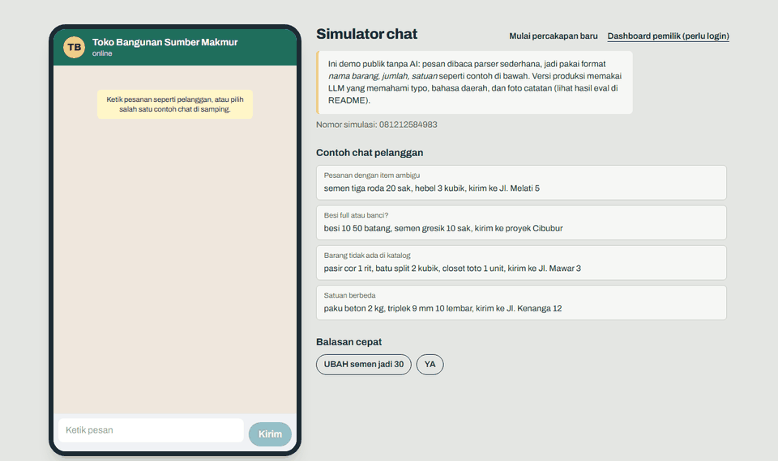
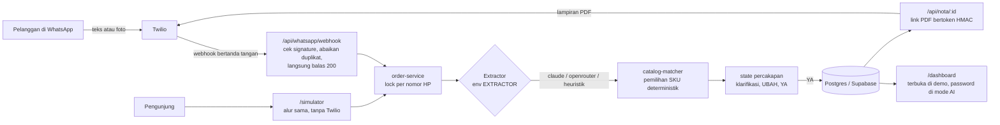

# Asisten Pesanan WhatsApp untuk Toko Bangunan

> **Ringkasan:** Asisten pesanan WhatsApp untuk toko bahan bangunan. Pelanggan mengetik (atau memfoto) daftar belanja seperti biasa, misalnya _"smen tigaroda 15 sak, besi 10 50 btg, kirim ke proyek pak budi"_. Sistem mencocokkan barang ke katalog, menanyakan item yang ambigu, menghitung total, meminta konfirmasi "YA", lalu mengirim nota PDF. Pemilik toko memproses pesanan dari dashboard. Dibangun dengan Next.js, Postgres, dan LLM (Claude atau model OpenRouter), dengan 168 unit test, 4 test E2E, dan eval 30 chat berlabel.

Aplikasi ini mengubah chat seperti itu menjadi pesanan yang sudah dihitung harganya:

1. Barang dicocokkan ke katalog toko, termasuk singkatan dan salah ketik.
2. Kalau ada barang yang ambigu (misalnya "besi 10" bisa full atau banci), bot bertanya balik.
3. Bot mengirim ringkasan dan total, lalu meminta konfirmasi "YA".
4. Setelah dikonfirmasi, pesanan masuk ke dashboard pemilik toko dan nota PDF dikirim ke pelanggan.

**Live demo:** [https://bangunan-mu.vercel.app/simulator](https://bangunan-mu.vercel.app/simulator) dan dashboard di [https://bangunan-mu.vercel.app/dashboard](https://bangunan-mu.vercel.app/dashboard) — tanpa login, tanpa biaya API (lihat [Public demo mode](#public-demo-mode)).



<sub>Demo publik memakai parser tanpa AI supaya tidak memakan biaya, jadi hanya memahami format sederhana. Versi dengan AI dijelaskan di bagian hasil uji.</sub>

## Arsitektur



AI hanya dipakai untuk merapikan teks bebas menjadi `{nama, qty, satuan}`. Pemilihan barang, harga, dan keputusan kapan harus bertanya ke pelanggan dikerjakan oleh kode biasa yang dites.

## Hasil uji

### Akurasi pada 30 chat berlabel

Data uji ([data/sample_orders.json](data/sample_orders.json)) berisi 6 chat mudah, 11 sedang, dan 13 sulit: salah ketik, bahasa Jawa/Sunda/Betawi, angka ditulis dengan huruf, satuan seperti "1 rit" dan "setengah kubik", koreksi di tengah chat, 8 barang ambigu, dan 2 barang yang tidak ada di katalog. Satu pesanan dihitung benar hanya kalau semua barang dan jumlahnya tepat dan semua barang ambigu ditanyakan.

| Extractor | Benar | Mudah | Sedang | Sulit | Latensi rata-rata | Biaya per pesanan |
|---|---|---|---|---|---|---|
| OpenRouter, model gratis (`nex-agi/nex-n2.5-mini:free`) | **28/30** | 6/6 | 10/11 | 12/13 | 3,3 detik | Rp0 |
| Tanpa AI (`heuristik`) | 1/30 | 0/6 | 1/11 | 0/13 | <0,1 detik | Rp0 |
| Matcher dengan input ideal | 30/30 | 6/6 | 11/11 | 13/13 | – | – |

<sub>Dijalankan 24 September 2026. Laporan lengkap ada di [eval/](eval/). Extractor Claude sudah dibuat dan dites dengan mock, tapi belum diuji dengan API sungguhan.</sub>

Dari tabel ini:

- Tanpa AI hanya 1 dari 30 chat yang benar, jadi untuk chat asli AI memang dibutuhkan.
- Dengan input ideal, matcher benar 30/30, jadi kedua kesalahan berasal dari langkah AI. Model mengubah "pasir" menjadi "pasir cor" sehingga tidak bertanya balik (#20), dan membaca "pralon 3 dim" sebagai pipa 3/4" (#26).

### Test

| Pemeriksaan | Hasil |
|---|---|
| Unit test (Vitest) | **168 lulus**: matcher (alias, typo, ukuran, satuan, barang ambigu, 30 sampel), parser dengan client mock, state percakapan, signature Twilio, hak akses, format nota/Rupiah, contoh demo publik |
| E2E (Playwright) | **4 lulus**: daftar dan detail pesanan, perubahan status baru → diproses → dikirim → selesai, simulator & dashboard bisa dibuka di mode demo, pesanan dari simulator muncul di dashboard |
| Lint, typecheck, build | Lulus |
| CI | [GitHub Actions](.github/workflows/ci.yml): validasi data, lint, typecheck, unit test, lalu E2E dengan Postgres |

## Keputusan teknis

1. **Pemilihan barang tidak diserahkan ke AI.** [catalog-matcher](lib/catalog-matcher.ts) mencocokkan nama dan alias, memperbaiki typo per kata dengan Fuse.js, dan menolak kandidat yang ukurannya tidak sama ("besi 10" tidak mungkin jadi "besi 8"). Kasus yang tidak bisa diputuskan diubah jadi pertanyaan bernomor. Hasilnya bisa dites tanpa API dan mudah dijelaskan ke pemilik toko.
2. **Webhook Twilio divalidasi dan tahan pesan ganda.** Signature `X-Twilio-Signature` dicek terhadap URL publik, webhook langsung membalas 200 supaya tidak melewati batas 15 detik Twilio, pekerjaan berat dijalankan di `after()`, dan pesan yang dikirim ulang Twilio diabaikan berdasarkan `MessageSid`.
3. **Lock per nomor HP.** Setiap pesan diproses dalam transaksi yang diawali `pg_advisory_xact_lock(hashtext(phone))`, jadi dua pesan cepat dari pelanggan yang sama tidak saling menimpa state percakapan. Lock ini berlaku per transaksi, sehingga tetap jalan lewat PgBouncer di Supabase.
4. **Link nota bertoken.** Twilio perlu mengunduh PDF tanpa login, sementara nomor pesanan berurutan dan mudah ditebak. Karena itu URL nota memakai token HMAC yang dicek dengan perbandingan timing-safe.
5. **Data uji dibuat sebelum mengatur prompt.** 30 chat berlabel, satu script untuk semua provider, pembanding tanpa AI, dan batas atas dengan input ideal. Dengan ini perubahan prompt, model, atau katalog bisa langsung diukur.

Halaman simulator & dashboard publik hanya terbuka jika `EXTRACTOR=heuristik`. Jika diubah ke model berbayar (`claude` / `openrouter`), otomatis terkunci password agar tidak memakan kredit API.

## Bug yang ditemukan saat pengujian

Setiap perbaikan disertai test regresi:

- Normalisasi Unicode merusak "½".
- Key React ganda membuat bubble chat tampil dobel.
- Dropdown status di dashboard tidak ikut berubah setelah tombol "Proses pesanan" diklik.
- Revisi "UBAH semen jadi 30" menghapus alamat kirim yang sudah ada.

## Batasan

- Extractor Claude belum diuji dengan API sungguhan.
- Hasil model gratis bisa berbeda antar percobaan. Di luar data uji, model pernah langsung menganggap "besi 10" sebagai full SNI tanpa bertanya, dan pernah mengubah "gg" (gang) menjadi "Gedung". Model gratis juga dibatasi sekitar 50 request per hari.
- Pesanan lewat foto belum diuji dengan model sungguhan.
- Pengiriman WhatsApp lewat Twilio baru diuji dalam mode dry-run.
- Demo publik hanya memahami format sederhana ("barang jumlah satuan") dan tidak menerima foto.
- Transaksi database tetap terbuka selama AI memproses pesan. Untuk MVP ini cukup, tapi trafik tinggi butuh antrean.
- Harga di katalog adalah perkiraan untuk demo, bukan harga toko sungguhan.
- Dashboard memakai satu password bersama (HTTP Basic Auth), belum ada akun per pengguna.

## Menjalankan secara lokal

Butuh Node.js 24 dan Python 3 (hanya untuk `npm run validate:data`).

```bash
npm install
cp .env.example .env          # pilih EXTRACTOR dan isi key yang sesuai
npm run db:local              # Postgres lokal di port 5433 (hentikan: npm run db:local stop)
npx prisma migrate dev        # buat tabel dan isi 50 produk dari data/catalog.json
npm run dev                   # http://localhost:3000/simulator dan /dashboard (user: admin)
```

| `EXTRACTOR` | Butuh | Catatan |
|---|---|---|
| `claude` | `ANTHROPIC_API_KEY` | Structured output dan fallback saat model menolak |
| `openrouter` | `OPENROUTER_API_KEY`, `OPENROUTER_MODEL` | Bisa diisi beberapa model dipisah koma sebagai cadangan |
| `heuristik` | – | Tanpa AI, format sederhana saja. Dipakai untuk demo publik dan E2E |

Untuk mencoba WhatsApp sungguhan lewat Twilio sandbox: isi variabel `TWILIO_*`, jalankan `ngrok http 3000`, isi `PUBLIC_BASE_URL` dengan URL ngrok (harus sama persis agar validasi signature lolos), lalu arahkan *When a message comes in* di sandbox ke `https://<url-ngrok>/api/whatsapp/webhook`. Tanpa `TWILIO_ACCOUNT_SID`, balasan hanya dicetak ke log.

Panduan deploy ke Vercel dan Supabase: [DEPLOY.md](DEPLOY.md).

| Perintah | Kegunaan |
|---|---|
| `npm test` / `npm run test:e2e` | Unit test / E2E Playwright |
| `npm run eval -- --provider=openrouter` | Uji akurasi dengan model sungguhan (`--only=10,16`, `--model=...`, `--out=...`) |
| `npm run eval -- --ideal` | Uji dengan hasil ekstraksi ideal, tanpa API |
| `npm run validate:data` | Cek semua SKU di data uji ada di katalog dan alias tidak dobel |

## Struktur

| Path | Isi |
|---|---|
| [lib/catalog-matcher.ts](lib/catalog-matcher.ts) | Pencocokan barang ke SKU |
| [lib/order-parser.ts](lib/order-parser.ts), [lib/openrouter-extractor.ts](lib/openrouter-extractor.ts) | Ekstraksi dengan AI (Claude / OpenRouter) |
| [lib/conversation.ts](lib/conversation.ts) | State percakapan (klarifikasi, UBAH, YA, BATAL) |
| [lib/order-service.ts](lib/order-service.ts) | Lock per nomor, abaikan duplikat, simpan pesanan |
| [app/api/whatsapp/webhook/route.ts](app/api/whatsapp/webhook/route.ts) | Webhook Twilio |
| [app/dashboard/](app/dashboard/), [app/simulator/](app/simulator/) | Dashboard pemilik toko, simulator chat |
| [scripts/eval.ts](scripts/eval.ts), [eval/](eval/) | Script uji akurasi dan laporannya |
| [data/](data/) | Katalog 50 produk dan 30 chat berlabel |

